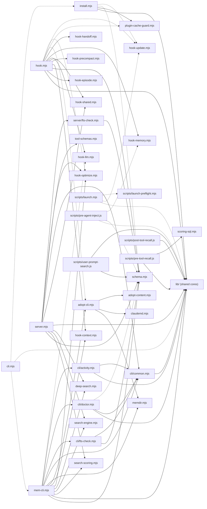

# qwen-mem-lite — Architecture

Generated 2026-09-05 against v3.96.0; **§3 and §4 regenerated 2026-09-06** on the
skill-registry removal branch (R9, `docs/audits/20260906-145304.md`), which deleted 11 source
modules — the previous §3/§4 named every one of them. Two earlier changes still govern how to
read them: the whole-tree reformat (`36f8c0f`) means **every LINE COUNT in §4 is post-reformat
and must not be compared with a figure quoted before it**, and edge extraction moved onto the
AST (P2-9), so §3's edge counts supersede any earlier quote. §1/§2/§5 hand-maintained; the
registry entries in them were removed by hand in the same pass.

Sections 3 and 4 are **tool output** — regenerate them rather than editing by hand:

```
npm run audit:deps        # §3 dependency matrix / upward edges / hubs / mermaid
npm run audit:inventory   # §4 module table (layer · lines · responsibility · exports)
```

Sections 1, 2 and 5 are hand-written from reading the entry points (`hook.mjs`,
`server.mjs`, `cli.mjs`, `install.mjs`, `hooks/hooks.json`, the three `scripts/*.js` hooks)
and are the part that needs a human when the flows change. Every claim below names the
file it was read from; a line without a file is an inference and is marked as such.

## 1. What it is

A persistent-memory plugin for Qwen Code and Claude Code. One SQLite database
(`~/.qwen-mem-lite/`, `better-sqlite3` + FTS5) holds observations, user prompts,
sessions and events. Three **faces** expose it:

| Face | Entry | Transport |
|---|---|---|
| Hooks | `hooks/hooks.json` → `scripts/hook-launcher.mjs` → `hook.mjs` / `scripts/*.js` | Qwen Code / Claude Code hook events, stdin JSON → stdout text / `additionalContext` |
| MCP server | `server.mjs` | stdio JSON-RPC, 9 listed + 9 hidden tools (`tool-schemas.mjs`) |
| CLI | `cli.mjs` → `mem-cli.mjs` (data) / `install.mjs` (lifecycle) | `qwen-mem-lite <cmd>` |

The faces share logic through `lib/*-core.mjs` (87 modules under `lib/`); the engines
(`search-engine.mjs`, `deep-search.mjs`, `hook-*.mjs`, `schema.mjs`) sit
beside them at the repo root. Rule from `CLAUDE.md`: **shared by two faces → `lib/`;
owned by one face → stays in that face's file.**

## 2. Layers and dependency direction

Layer assignment is `layerOf()` in `scripts/audit-metrics.mjs` — path-based, so the
matrix in §3 is reproducible.

```
entry    cli.mjs · hook.mjs · server.mjs · install.mjs · scripts/*.js hooks · scripts/hook-launcher.mjs
  │
face     mem-cli.mjs · cli/*.mjs · server/*.mjs · adopt-cli.mjs        (arg parsing + rendering)
  │
engine   hook-*.mjs · search-engine · deep-search · rerank · scoring-sql · search-scoring
         haiku-client · schema · memdir · claudemd · tool-schemas …
  │  ▲
lib/     87 shared cores (search-core, save-observation, maintain-core, citation-tracker, …)
  │
leaf     utils.mjs (barrel) · format-utils · project-utils · tfidf · nlp · tier · secret-scrub · stop-words …
```

Measured direction (§3, 2026-09-05): **0 static cycles, 0 lazy cycles** (also pinned by
`tests/import-graph.test.mjs`). The graph is a DAG but **not strictly layered**:

- `lib → engine` has 12 edges. This is by design — a shared core fronts the engine it
  wraps (`lib/search-core.mjs → search-engine.mjs`, `lib/hook-prune.mjs → install.mjs`).
  **None of them reaches the hook layer any more.** Two used to: `lib/lesson-bridge.mjs`
  and `lib/startup-dashboard.mjs` imported `hook-shared.mjs`, which
  `tests/observation-vector-single-writer.test.mjs` waved through as a named exception
  (that file was DELETED with the TF-IDF vector arm in Phase-2; the import-direction rule it
  carried now lives in the shared import-graph guard)
  (audit 2026-09-02 P2-9 → 2026-09-05 P1-2). The three symbols they needed now live in
  `lib/llm-call.mjs`, `lib/quiet-scope.mjs` and `lib/handoff-constants.mjs` — which is
  where 4 of the current 12 come from (`→ haiku-client`, `→ memdir/claudemd/adopt-content`)
  — and the guard's exception is deleted, so `lib/` may now import no `hook-*.mjs` at all.
  (Round 2 recorded 13 here; the 13th was the P2-9 phantom below, gone in round 3.)
- §3's edges are read from the **AST**, so comments and string literals are not edges
  (audit 2026-09-05 P2-9, fixed in round 3). Until then `edgesOf()` regexed raw source and
  counted the commented-out `await import('../hook-optimize.mjs')` at
  `lib/save-enrich.mjs:175` as a live lazy edge into the hook layer — 49 lazy edges where
  there are 48. The same extraction feeds `cycles()`, so that class of miscount could
  report a cycle nobody wrote. `--self-check` now carries YES and NO arms for it.
- `leaf → lib` has 9 edges, all from `utils.mjs`/`tfidf.mjs`/`tier.mjs`/`format-utils.mjs`
  /`secret-scrub.mjs` into small `lib/` leaves (`time-constants`, `private-strip`, `rrf`,
  `resolve-data-dir`, `low-signal-patterns`, `inject-search-core`). `utils.mjs` is a
  backward-compat barrel (v2.21), so "leaf" is a naming convenience, not a layer.

So the honest picture is four tiers — **entry → face → {engine ⇄ lib} → leaf** — with the
middle tier a single mutual layer. Nothing in `lib/` or `engine` imports a face or an entry
(matrix rows `engine`/`lib`: 0 edges into `entry`/`face`).

## 3. Dependency graph (generated: `npm run audit:deps`)

> node scripts/audit-metrics.mjs --deps

Modules: 148 · edges: 432 static + 44 lazy (relative `import`/`export … from` + literal `import()`, read from the AST — comments and string literals are not edges).

### Layer matrix (rows import columns; count of edges)

| from \ to | entry | face | engine | lib | leaf | tooling |
|---|---|---|---|---|---|---|
| **entry** | 2 | 4 | 26 | 105 | 13 | 2 |
| **face** | 0 | 8 | 14 | 38 | 6 | 0 |
| **engine** | 0 | 0 | 29 | 59 | 21 | 0 |
| **lib** | 0 | 0 | 11 | 78 | 37 | 0 |
| **leaf** | 0 | 0 | 1 | 7 | 10 | 0 |
| **tooling** | 0 | 0 | 0 | 4 | 1 | 0 |

### Upward edges (lower layer importing a higher one; tooling excluded): 19

- lib → engine: 11 (sanctioned — shared cores front the engines)
  - `lib/error-recall-core.mjs` → `scoring-sql.mjs`
  - `lib/get-core.mjs` → `search-scoring.mjs`
  - `lib/inject-search-core.mjs` → `scoring-sql.mjs`
  - `lib/llm-call.mjs` → `haiku-client.mjs`
  - `lib/quiet-scope.mjs` → `memdir.mjs`
  - `lib/quiet-scope.mjs` → `claudemd.mjs`
  - `lib/quiet-scope.mjs` → `adopt-content.mjs`
  - `lib/save-enrich.mjs` → `haiku-client.mjs` (lazy)
  - `lib/search-core.mjs` → `search-engine.mjs`
  - `lib/search-core.mjs` → `scoring-sql.mjs`
  - `lib/timeline-core.mjs` → `search-engine.mjs`
- leaf → lib / engine: 8
  - `format-utils.mjs` → `lib/time-constants.mjs`
  - `secret-scrub.mjs` → `lib/private-strip.mjs`
  - `tier.mjs` → `lib/time-constants.mjs`
  - `utils.mjs` → `lib/low-signal-patterns.mjs`
  - `utils.mjs` → `scoring-sql.mjs`
  - `utils.mjs` → `lib/private-strip.mjs`
  - `utils.mjs` → `lib/resolve-data-dir.mjs`
  - `utils.mjs` → `lib/err-sampler.mjs` (lazy)
- other: 0

### Hubs

| Most imported (fan-in) | edges | Most importing (fan-out) | edges |
|---|---|---|---|
| `utils.mjs` | 45 | `mem-cli.mjs` | 47 |
| `lib/time-constants.mjs` | 26 | `hook.mjs` | 46 |
| `lib/inject-search-core.mjs` | 23 | `server.mjs` | 33 |
| `schema.mjs` | 15 | `scripts/pre-tool-recall.js` | 22 |
| `lib/resolve-data-dir.mjs` | 14 | `install.mjs` | 17 |
| `format-utils.mjs` | 9 | `scripts/user-prompt-search.js` | 15 |
| `lib/scrub-record.mjs` | 9 | `hook-llm.mjs` | 14 |
| `hook-shared.mjs` | 8 | `hook-optimize.mjs` | 12 |
| `lib/atomic-write.mjs` | 8 | `hook-update.mjs` | 11 |
| `project-utils.mjs` | 8 | `utils.mjs` | 11 |
| `scoring-sql.mjs` | 8 | `hook-context.mjs` | 9 |
| `haiku-client.mjs` | 7 | `hook-memory.mjs` | 9 |

### Entry → module graph (mermaid; static edges from entry/face files into engine-layer modules, lib/ and leaves collapsed)



## 4. Module inventory (generated: `npm run audit:inventory`)

> node scripts/audit-metrics.mjs --inventory


### Entry points

| Module | Lines | Responsibility | Public interface (exports; `*` = re-export) |
|---|---|---|---|
| `cli.mjs` | 149 | (no header comment) | (entry — no exports) |
| `hook.mjs` | 3268 | Hook v2 — Cognitive memory architecture Selective encoding, episodic batching, error-triggered recall Hooks (fast <100ms): post-tool-use,… | (entry — no exports) |
| `install.mjs` | 2739 | Installer — Smart install/uninstall/status/doctor | HOOK_SCRIPT_FILES, probeBetterSqlite3Binding, ensureBetterSqlite3Working, copyHookScripts(), migrateLegacyClaudeMemData(), bumpJsonField(), patchClaudeMdVersion() … (+11) |
| `scripts/hook-launcher.mjs` | 552 | Self-healing wrapper for Node hook entry points. Why: pre-v2.84 a stale-manifest bug in hook-update.mjs could leave the install with a hook.mjs that… | (entry — no exports) |
| `scripts/launch-preflight.mjs` | 83 | Detect incomplete installs at MCP server launch. Why: issue #15 — published v2.53.0 npm tarball contains all files, but some users end up with a… | detectMissingImports(), resolveLaunchEntry() |
| `scripts/launch.mjs` | 199 | Auto-installs dependencies then starts MCP server Uses only Node built-ins so it works before npm install | (entry — no exports) |
| `scripts/post-tool-recall.js` | 120 | PostToolUse companion to pre-tool-recall.js for the bind-salience forcing-function (component 2). After an Edit/Write, if a lesson surfaced for this… | (entry — no exports) |
| `scripts/pre-agent-inject.js` | 150 | PreToolUse:Agent/Task hook — subagent dispatch-time memory injection. Subagents are memory-blind (plugin hooks do NOT fire inside them — #8848); this… | (entry — no exports) |
| `scripts/pre-tool-recall.js` | 885 | PreToolUse file recall — injects lessons before Edit/Write Lightweight standalone (~30ms): only imports better-sqlite3, fs, path, os, and the… | (entry — no exports) |
| `scripts/user-prompt-search.js` | 1069 | Auto-search memory on user prompt Runs as UserPromptSubmit hook — injects relevant memories before Claude sees the prompt Lightweight: only imports… | corpusFloorScale, hasExplicitSignal(), IDENTIFIER_BYPASS, extractTechIdentifiers(), rowMatchesIdentifier(), searchByFts(), isDirectInvocation() |
| `server.mjs` | 2070 | MCP Server — All-in-one memory system FTS5 search, zero LLM calls, single process | handleSearchForTest(), handleRecentForTest(), SAVE_TEXT_LIMITS, clampSaveText(), handleExportForTest(), SPAWN_LOG_RETENTION_MS, SPAWN_LOG_MAX_LINES … (+2) |

### Faces (arg parsing + rendering)

| Module | Lines | Responsibility | Public interface (exports; `*` = re-export) |
|---|---|---|---|
| `adopt-cli.mjs` | 484 | CLAUDE.md-steering plan (v3.13): CLI handlers for qwen-mem-lite adopt [--all] [--force] [--dry-run] [--status] [--disable/--enable] qwen-mem-lite… | disableSentinelPath(), isAutoAdoptDisabled(), cmdAdopt(), silentAutoAdopt(), hasAutoAdoptMarker(), cmdUnadopt() |
| `cli/activity.mjs` | 222 | `qwen-mem-lite activity <save/search/recent/show>`. Extracted from mem-cli.mjs (v2.41, god-module split). Thin wrapper over lib/activity.mjs pure… | cmdActivity() |
| `cli/common.mjs` | 447 | shared helpers used by every per-command file under cli/. Extracted from mem-cli.mjs (v2.41) as first step in the god-module split. Scope: pure… | parseArgs(), out(), outVerbatim(), fail(), rejectBareStringFlags(), resolvePositionalAlias(), KNOWN_CLI_FLAGS … (+9) |
| `cli/doctor.mjs` | 117 | `qwen-mem-lite doctor --benchmark/--metrics`. Extracted from mem-cli.mjs (v2.41, god-module split). `doctor` without flags is handled upstream by… | cmdDoctor() |
| `cli/fts-check.mjs` | 54 | `qwen-mem-lite fts-check <check/rebuild>`. Extracted from mem-cli.mjs (v2.41, god-module split). | cmdFtsCheck() |
| `mem-cli.mjs` | 3814 | CLI — lightweight command layer for direct memory access No MCP SDK or heavy deps — only imports schema.mjs and utils.mjs READ commands resolve the… | OBS_TIME_FIELDS, formatObsFieldValue, cmdSearchForTest(), run() |
| `server/fts-check.mjs` | 36 | MCP `mem_fts_check` handler. Extracted from server.mjs (v2.41, god-module split). Pure delegate to schema.mjs helpers; Zod filters args.action before… | handleMemFtsCheck() |

### Engines (root modules)

| Module | Lines | Responsibility | Public interface (exports; `*` = re-export) |
|---|---|---|---|
| `adopt-content.mjs` | 187 | CLAUDE.md-steering plan (v3.13): content generators for the qwen-mem-lite managed block (written into <cwd>/CLAUDE.md) and its companion… | PLUGIN_SLUG, CURRENT_SENTINEL_VERSION, buildClaudeMdBlock(), getDetailDoc() |
| `claudemd.mjs` | 333 | CLAUDE.md-steering plan (v3.13): claudemd.mjs — primitives for the project-tree managed block at <cwd>/CLAUDE.md plus an on-demand detail doc at… | claudeMdPath(), detailDocPath(), readBlock(), isAdopted(), hasResidue(), needsRefresh(), writeManaged() … (+3) |
| `deep-search.mjs` | 621 | Opt-in LLM multi-query / HyDE deep search. This is the EXPLICIT "search harder" path — it is NOT on the passive hook pipeline, which stays… | MAX_VARIANTS, AUTO_DEEP_MIN_RESULTS, AUTO_DEEP_MIN_CORPUS, hasEscalatableCorpus(), autoDeepLlmReady(), shouldEscalateToDeep(), resolveDeepMode() … (+11) |
| `haiku-client.mjs` | 871 | Unified LLM call wrapper Shared by memory (hook.mjs) and dispatch modules Provider priority: ANTHROPIC_API_KEY (direct Anthropic API) →… | BG_LLM_TIMEOUT_MS, resolveModel(), resolveOpenRouterModel(), detectMode(), _resetMode(), getClaudePath(), splitPrompt() … (+13) |
| `hook-context.mjs` | 752 | CLAUDE.md context injection and token budgeting SHARED ENGINE — the `hook-` prefix is historical, not a scope. buildSessionContextLines is imported… | computeAdaptiveWindows(), sectionQuotas(), selectWithTokenBudget(), cleanupClaudeMdLegacyBlock(), buildSessionContextLines(), buildSummaryLines() |
| `hook-episode.mjs` | 489 | episode buffer management Handles file-based episode storage with advisory locking and pending entry recovery | readEpisodeRaw(), episodeFile(), lockFile(), acquireLock(), releaseLock(), readEpisode(), writeEpisode() … (+7) |
| `hook-handoff.mjs` | 691 | Cross-session handoff extraction, detection, and injection Extracted for testability — hook.mjs has module-level side effects | buildAndSaveHandoff(), detectContinuationIntent(), pickHandoffToInject(), renderHandoffInjection(), extractUnfinishedSummary() |
| `hook-llm.mjs` | 1604 | Background LLM workers for episode extraction and session summaries Extracted from hook.mjs for testability and reduced complexity | retractPreSavedObs(), recordRetryAttempt(), readRetryStats(), saveObservation(), persistHaikuSummary(), buildDegradedTitle(), saveEpisodeImmediate() … (+7) |
| `hook-memory.mjs` | 731 | — Semantic Memory Injection Search past observations for relevant memories to inject as context at user-prompt time. | formatMemoryLine(), searchRelevantMemories(), IMPERATIVE_POOL_BACKSTOP, rankImperativeCandidates(), selectImperativeLesson(), buildSubagentInjection() |
| `hook-optimize.mjs` | 1543 | LLM-powered database optimization SHARED ENGINE — the `hook-` prefix is historical, not a scope. All three entry surfaces import this: hook.mjs… | distributeBudget(), findReenrichCandidates(), countReenrichCandidates(), executeReenrich(), _normalizeGateOpen(), shouldRunNormalize(), extractUniqueConcepts() … (+14) |
| `hook-precompact.mjs` | 63 | PreCompact hook handler. Fires immediately before Claude Code auto-compaction begins. Emits a fresh <claude-mem-context> block on stdout so the… | handlePreCompact(), entry() |
| `hook-semaphore.mjs` | 199 | LLM concurrency semaphore Limits concurrent claude -p calls to prevent resource contention | LLM_SEM_MAX, LLM_SEM_TIMEOUT, LLM_SEM_STALE_MS, sleepMs, _setLocalHeldAt(), acquireLLMSlot(), releaseLLMSlot() |
| `hook-shared.mjs` | 429 | Shared infrastructure for hook.mjs and hook-llm.mjs Constants, session management, DB access, LLM calls, process utilities | callLLM*, isQuietHooks*, isAdoptedHere*, effectiveQuiet*, HANDOFF_EXPIRY_CLEAR*, HANDOFF_EXPIRY_EXIT*, HANDOFF_ANCHOR_MAX_AGE* … (+29) |
| `hook-update.mjs` | 1428 | Auto-update via GitHub Releases Checks for new versions on SessionStart, downloads and installs automatically. Skips in dev mode (symlinked… | checkForUpdate(), getCachedUpdateBanner(), isUpdateCheckDue(), fetchLatestRelease(), compareVersions(), getCurrentVersion(), createUpdateTmpDir() … (+10) |
| `memdir.mjs` | 432 | Phase B (Invited-Memory plan): memdir.mjs — primitives for the per-project Claude Code memdir at ~/.claude/projects/<encoded>/memory/. The public API… | UserEditedError, BudgetExceededError, encodeProjectPath(), memdirPath(), readMemoryIndex(), writePluginSection(), removePluginSection() … (+5) |
| `plugin-cache-guard.mjs` | 197 | Plugin cache hook sentinel. Claude Code runtime reads plugin hooks from ~/.claude/plugins/cache/<marketplace>/<plugin>/<version>/hooks/hooks.json NOT… | DEFAULT_MARKETPLACE, DEFAULT_PLUGIN, scanPluginCacheHookPollution(), clearPluginCacheHooks(), pluginCacheHookEvents(), hasInstallManagedHooks(), hasLiveInstallManagedHooks() |
| `rerank.mjs` | 95 | Shared LLM-rerank core: reorder a top-K candidate list by an LLM relevance read. Used by BOTH the production deep-search rerank stage… | extractRanked(), llmRerankOrder(), defaultRerankLLM() |
| `schema.mjs` | 1571 | shared database schema and initialization Used by both server.mjs (MCP process) and hook.mjs (hook process) Ensures DB + tables exist regardless of… | DB_DIR, DB_PATH, CODE_DIR, CURRENT_SCHEMA_VERSION, initSchema(), auditSessionConsistency(), runDeferredCleanups() … (+8) |
| `scoring-sql.mjs` | 282 | SQL constants for BM25 scoring and temporal decay. Extracted from utils.mjs for focused module boundaries. ─── Why these multipliers exist (read… | DECAY_HALF_LIFE_BY_TYPE, DEFAULT_DECAY_HALF_LIFE_MS, OBS_BM25, SESS_BM25, EVT_BM25, OBS_FTS_COLUMNS, TYPE_DECAY_CASE … (+11) |
| `search-engine.mjs` | 671 | Shared observation-search engine — the single source of truth for FTS5 BM25 ranking, OR fallback, and concept/PRF expansion. A TF-IDF vector arm and… | buildObsFtsQuery(), buildObsFtsParams(), countObsFtsMatches(), countSessionFtsMatches(), countPromptFtsMatches(), countEventFtsMatches(), countSearchTotal() … (+4) |
| `search-scoring.mjs` | 397 | shared search-scoring / ranking helpers: re-ranking, supersede marking, PRF term extraction, concept-expansion — plus the MCP instructions builder… | buildServerInstructions(), reRankWithContext(), PRF_STOP_WORDS, extractPRFTerms(), expandQueryByConcepts(), autoBoostIfNeeded(), runIdleCleanup() |
| `tool-schemas.mjs` | 952 | Shared Zod schemas for MCP tool inputs Single source of truth — used by server.mjs (runtime) and contract.test.mjs (validation tests) LLM-friendly… | OBS_TYPE_ENUM, memSearchSchema, memRecentSchema, memTimelineSchema, memGetSchema, memDeleteSchema, memSaveSchema … (+13) |

### Shared cores (lib/)

| Module | Lines | Responsibility | Public interface (exports; `*` = re-export) |
|---|---|---|---|
| `lib/activity.mjs` | 222 | activity namespace data layer (T7 v2.31) Pure functions over the events table. No I/O beyond the passed-in db handle. Activity events are NOT… | EVENT_TYPES, saveEvent(), getEvent(), searchEvents(), recentEvents(), promoteInsightEvents() |
| `lib/atomic-write.mjs` | 95 | crash-safe file writes with optional one-time backup. Why: several write paths mutate user-global config that, if torn or clobbered, breaks the user… | atomicWriteFileSync() |
| `lib/binding-probe.mjs` | 434 | better-sqlite3 native binding probe + auto-rebuild. Shared by install.mjs (verify after `npm install`) and scripts/launch.mjs (verify before… | NATIVE_BINDING_REBUILD_CMD, NATIVE_BINDING_SOURCE_BUILD_CMD, nativeBindingRepairHint(), BINDING_HEAL_GUARD_ENV, isNativeBindingError(), flattenBindingError(), probeBetterSqlite3Binding() … (+3) |
| `lib/browse-core.mjs` | 81 | shared data collection for the CLI `browse` / MCP `mem_browse` twin (P2-12, audit 2026-08-14). The tier count + row queries were duplicated and had… | BROWSE_TIERS, BROWSE_TIER_LABELS, getActiveMemorySessionId(), collectBrowseTiers() |
| `lib/citation-tracker.mjs` | 1936 | Citation tracker (P4): scan Claude Code transcript for `#NN` observation-id citations in assistant text, then bulk-increment access_count for matched… | OBS_ID_DIGITS, citationIdRe(), unanchoredInjectedIdRe(), extractCitationsFromTranscript(), classifyCitationContext(), computeCiteRecall(), extractUserTypedIds() … (+27) |
| `lib/cite-back-hint.mjs` | 378 | PostToolUse cite-back hint builder. Fires when a flushed episode edits a file that PreToolUse:Read/Edit had nudged earlier in the same session — the… | buildCiteBackHint(), buildUnsavedBugfixHint(), countUnsavedBugfixShape(), CITE_NUDGE_SILENCE_AFTER, nextCiteLowStreak(), nextCiteStreakState(), buildCiteRecallNudge() … (+2) |
| `lib/cite-recall-path.mjs` | 54 | the ONE definition of the cite-recall snapshot file's path. Same shape, same failure mode and same fix as lib/cooldown-path.mjs (audit 2026-08-29… | CITE_RECALL_FILE_PREFIX, citeRecallProjectKey(), citeRecallPathFor() |
| `lib/cli-flags.mjs` | 72 | CLI numeric-flag validation helper. Extends the audit pattern from #8277 (Number.isInteger + range check) with a single reusable surface that also… | isNumericToken(), parseIntFlag() |
| `lib/cli-project.mjs` | 128 | which project a terminal-invoked CLI command should read. `inferProject()` names the directory the process stands in (CLAUDE_PROJECT_DIR // PWD //… | findGitRoot(), _resetCliProjectCache(), resolveCliProject() |
| `lib/compress-core.mjs` | 149 | Shared "compress old low-value observations into weekly summaries" core. Single source of truth for cmdCompress (CLI), mem_compress (MCP), and… | selectCompressionCandidates(), groupByProjectWeek(), compressGroup() |
| `lib/cooldown-path.mjs` | 44 | the ONE definition of the pre-recall cooldown file's path. The rule (sanitize the session id, cap it at 64 chars, join it to RUNTIME_DIR under a… | COOLDOWN_FILE_PREFIX, cooldownSessionKey(), cooldownPathFor() |
| `lib/db-backup.mjs` | 161 | point-in-time DB snapshot before irreversible maintenance. VACUUM INTO produces a consistent, compact copy of the database (WAL-safe — unlike… | backupBudgetBytes(), BACKUP_EVICTION_GRACE_MS, listSnapshots(), enforceBackupBudget(), snapshotDb() |
| `lib/dedup-constants.mjs` | 44 | Dedup / merge similarity thresholds — single source of truth (P10). All values are Jaccard-space (word-set overlap, 0..1) unless noted. They were… | DEDUP_JACCARD_THRESHOLD, AUTO_MERGE_THRESHOLD, MERGE_JACCARD_LOW, MINHASH_PRE_THRESHOLD, MINHASH_PREFILTER, FUZZY_DEDUP_THRESHOLD, FUZZY_BODY_THRESHOLD |
| `lib/deferred-work.mjs` | 473 | — deferred_work data layer Pure-data CRUD + ordinal resolver + transactional closure helper. Decoupled from observations table: different lifecycle,… | insertDeferred(), listOpenWithOrdinal(), formatDeferListRow(), countStaleOpen(), formatDeferStaleHint(), dropDeferred(), formatDropReasonHint() … (+6) |
| `lib/delete-core.mjs` | 113 | shared hard-delete orchestration for the CLI `delete` command (mem-cli.mjs cmdDelete) and the MCP `mem_delete` tool (server.mjs). Both surfaces… | deleteObservations(), previewDeleteRows() |
| `lib/doctor-benchmark.mjs` | 162 | Baseline benchmark capture for v2.31 MVP. Measures (bounded scope): - L2 MCP instructions byte count (cost-per-turn source). - Count of registered… | runBenchmark() |
| `lib/doctor-drift.mjs` | 157 | Dev-drift check: in dev-mode installs (symlinked to project repo), every managed source file in INSTALL_DIR should be a symlink. A regular file means… | checkDevDrift(), HOOK_SCRIPT_ENTRY_POINTS, checkHookScriptDrift() |
| `lib/edge-attribution.mjs` | 169 | P1 (D#78): per-(obs, file) edge attribution for pre-tool-recall injections. pre-tool-recall triggers purely on file-edge matches (observation_files),… | readPreRecallFileEdges(), resolveEdgeAttribution() |
| `lib/efficacy-arms.mjs` | 36 | pure arm-semantics for the efficacy severe test. ONE tested source of truth for "what does arm X mean", because a wrong per-arm env silently… | INJECTED_ARMS, armConfig(), taskSuffixForArm() |
| `lib/efficacy-bridge-select.mjs` | 15 | pure helpers for the efficacy arm-B measurement: (1) select only commits where the bridge CAN bind (lesson identifier ∈ edit region), (2) verify the… | lessonBindsToRegion(), BRIDGE_MARKER, bridgeFired() |
| `lib/env-number.mjs` | 104 | Numeric environment overrides with an explicit failure mode. The idiom this replaces — `Number(process.env.X // DEFAULT)` — has no failure mode at… | envNumber() |
| `lib/err-sampler.mjs` | 97 | sampled append-only log of swallowed errors. Rationale: debugCatch previously only surfaced errors when QWEN_MEM_DEBUG was on. In production,… | maybeSampleError(), _sampleRate(), SAMPLE_LOG_RETENTION_MS |
| `lib/error-recall-core.mjs` | 400 | Error-triggered recall — the SELECTION half of the surface. Why this is a shared core and not left inline in hook.mjs (project convention "shared by… | ERROR_RECALL_LIMIT, DEFAULT_ERROR_RECALL_BM25_FLOOR, CALIBRATED_ERROR_RECALL_BM25_FLOOR, errorRecallBm25Floor(), errorRecallSql(), errorRecallFtsQuery(), selectErrorRecall() |
| `lib/events-injection.mjs` | 135 | surface `events` into the passive injection surfaces. HIGH-1 (full audit 2026-07-16): persistHaikuSummary upgrade-deletes every event-typed memory… | searchInjectableEvents(), recentInjectableEvents(), renderInjectableEvent() |
| `lib/export-columns.mjs` | 122 | Single source of truth for the observation columns that `export` emits and `restore` reads back. Both the CLI (`cmdExport` in mem-cli.mjs) and the… | EXPORT_COLUMNS, EXPORT_COLUMNS_SQL, buildExportWhere() |
| `lib/fast-summary.mjs` | 111 | The non-LLM session summary — one shape, three callers. Audit 2026-08-22 P2-9. hook.mjs carried three hand-copied versions of "read this session's… | FAST_SUMMARY_LIMITS, readFastSummarySource(), insertFastSummary() |
| `lib/file-edge-match.mjs` | 82 | Single source of truth for the (obs,file) trigger-edge match predicate. Two consumers MUST stay in byte-identical agreement or injection and… | fileMatchClause(), basenameAnySep(), fileMatchParams() |
| `lib/file-intel.mjs` | 185 | pure, zero-dependency builder for the PreToolUse:Read "file intelligence" injection (feature ①). Before Claude reads a file, surface its approximate… | estimateContentTokens(), humanTokens(), extractFileSummary(), formatFileIntelLine(), fileIntelFor() |
| `lib/frontmatter.mjs` | 83 | the ONE YAML-frontmatter parser for skill/agent markdown. Audit 2026-09-02 P1-16. There were three, and they were not all the same:… | parseFrontmatter() |
| `lib/get-core.mjs` | 193 | shared core for the CLI `get` / MCP `mem_get` twin (P2-12, audit 2026-08-14). The 23-element OBS_FIELDS array was duplicated verbatim in mem-cli.mjs… | OBS_FIELDS, SESSION_DETAIL_FIELDS, PROMPT_DETAIL_FIELDS, EVENT_DETAIL_FIELDS, fetchPromptDetail(), fetchSessionDetail(), fetchEventDetail() … (+2) |
| `lib/git-state.mjs` | 53 | thin wrapper around git status/stash/HEAD sha (T10b). Used by startup-dashboard (T10c) and continuation-anchor detection (T10d). All calls are… | readGitState() |
| `lib/handoff-constants.mjs` | 18 | cross-session handoff policy, defined once. Moved out of `hook-shared.mjs` (audit 2026-09-05 P1-2): `lib/startup-dashboard.mjs` imported… | HANDOFF_EXPIRY_CLEAR, HANDOFF_EXPIRY_EXIT, HANDOFF_ANCHOR_MAX_AGE, HANDOFF_MATCH_THRESHOLD, CONTINUE_KEYWORDS |
| `lib/hook-prune.mjs` | 133 | settings.json hook-entry classification and reconciliation. Extracted here because TWO faces need it and a direct import would close a cycle:… | isMemHook(), launcherEntryPath(), pruneDanglingMemHooks() |
| `lib/hook-stdin.mjs` | 147 | one bounded stdin reader for every hook entry point. Audit 2026-09-02 P1-9. Six hook processes read the host's JSON payload off stdin and they did it… | DEFAULT_STDIN_MAX_BYTES, TOOL_INPUT_FILE_MAX_BYTES, salvageTruncatedHookEvent(), DEFAULT_STDIN_TIMEOUT_MS, readHookStdin() |
| `lib/hook-stdout.mjs` | 262 | one hook process, at most ONE JSON document on stdout. Claude Code parses a command hook's stdout as a SINGLE JSON document. From the 2.1.233 bundle,… | queueHookContext(), queueHookUpdatedInput(), queueHookSystemMessage(), flushHookStdout(), resetHookStdout(), peekHookStdout() |
| `lib/hook-telemetry.mjs` | 183 | unsampled hook-error log. Distinct from lib/err-sampler.mjs: that one writes 1% of swallowed debugCatch errors into ${dbDir}/errors/ for *production… | recordHookError(), countRecentHookErrors(), HOOK_ERROR_RETENTION_MS |
| `lib/id-routing.mjs` | 121 | Shared probe for "ID-not-found-in-requested-source" hints + shared token parser. Used by CLI (mem-cli.mjs, cli/common.mjs re-export) and MCP… | parseIdToken(), bucketIdTokens(), splitDeferredTokens(), probeOtherSources() |
| `lib/import-jsonl.mjs` | 358 | import a Claude Code JSONL transcript file into the memory DB. One transcript ≈ one Claude Code session; we map: user line -> user_prompts row… | MAX_IMPORT_BYTES, importJsonl() |
| `lib/inject-search-core.mjs` | 98 | the retrieval-side shared core (P2-11, audit 2026-08-14; second cut D#123, 2026-08-16). Shared home for the three SQL atoms that kept drifting across… | liveObsFilterSql(), recencyDecaySql(), injectionRelevanceSql() |
| `lib/injected-ids.mjs` | 232 | the cross-hook injected-ids dedup marker: file name, freshness + same-session gate, and payload shape. Single source of truth for… | injectedIdsFileName(), readInjectedMarker(), mergeInjectedMarker(), injectedIdKey(), EVENT_ID_PREFIX, keyContextIdsFileName() |
| `lib/install-shape.mjs` | 302 | which code homes does this machine actually RUN? qwen-mem-lite can occupy three code homes at once and they are not interchangeable: plugin cache… | hasManagedCodeInstall(), listPluginCacheVersions(), detectInstallShape(), probeRuntimeRoots() |
| `lib/keyctx-marker.mjs` | 118 | the one place the SessionStart Key Context render is recorded. Two things happen together because they must describe the SAME set: ① the per-session… | KEYCTX_TOUCH_AFTER_MS, recordKeyContextInjection(), touchKeyContextMarker() |
| `lib/lesson-bridge.mjs` | 42 | pure prompt builder + fail-open Haiku bridge for the comprehension-bridge forcing-function (QWEN_MEM_SALIENCE=bridge). Loaded by… | buildBridgePrompt(), bridgeLesson() |
| `lib/lesson-idents.mjs` | 32 | pure, zero-dependency extractor of code identifiers a lesson names, for the bind-salience PostToolUse "dropped a required reference" check… | extractIdents(), presentIdents() |
| `lib/llm-call.mjs` | 76 | the provider-routed background LLM call (Anthropic API → OpenRouter → claude CLI). It lived in `hook-shared.mjs`, which is the hook layer's own… | callLLM() |
| `lib/llm-provider-probe.mjs` | 115 | "is the configured LLM provider actually usable?" Every keyed-provider dispatcher in haiku-client.mjs degrades to `claude -p` when the API call… | tcpReachable(), llmProviderStatus() |
| `lib/low-signal-patterns.mjs` | 237 | Single source of truth for LOW_SIGNAL title patterns. "LOW_SIGNAL" = hook-llm fallback titles written when Haiku summarization is unavailable or… | LOW_SIGNAL_PATTERNS, buildLowSignalRegex(), buildNotLowSignalSql(), capNoiseImportance(), isLowYieldChangeObs(), isNoiseObservation() |
| `lib/maintain-core.mjs` | 985 | Shared maintenance operations — single source of truth for cmdMaintain (CLI), mem_maintain (MCP), and handleAutoMaintain (hook). Pre-extraction each… | STALE_AGE_MS, OP_CAP, SCAN_LIMIT, DUPLICATE_LIMIT, SIMILARITY_THRESHOLD, MINHASH_PRE_THRESHOLD, PINNED_INJ_THRESHOLD … (+21) |
| `lib/mem-override.mjs` | 33 | User-explicit "ignore memory" override detector. Mirrors CC built-in memoryTypes.ts:215 ("If the user says to *ignore* or *not use* memory: Do not… | detectMemOverride() |
| `lib/metrics.mjs` | 193 | optional time-series metric sink. Rationale: mem_stats --quality gives a snapshot, not a trend. If search latency degrades or the coverage filter's… | recordMetric(), timed(), gcOldMetricShards(), DEFAULT_WINDOW_DAYS, readMetrics(), aggregateMetrics(), formatSummary() |
| `lib/native-binding-hint.mjs` | 185 | friendly, rate-limited hint for an unloadable native DB binding (better-sqlite3 ERR_DLOPEN_FAILED, e.g. a Node version upgrade leaves the prebuilt… | NATIVE_BINDING_HINT_COOLDOWN_MS, NATIVE_BINDING_BROKEN_MARKER, nativeBindingHintDue(), formatHookError(), recordNativeBindingBreakage(), readNativeBindingBreakage(), clearNativeBindingBreakage() |
| `lib/obs-types.mjs` | 12 | Single source of truth for the observation `type` vocabulary. Audit 2026-07-17 MED-3: this list was hardcoded verbatim in 10 JS sites + the SQL CHECK… | OBS_TYPES, OBS_TYPE_SET |
| `lib/observation-write.mjs` | 266 | Single source of truth for the observations-table write surface. Two ingest paths previously hand-wrote divergent INSERTs — lib/save-observation.mjs… | normalizeScope(), SCOPE_PROMPT_LEGEND, insertObservationRow(), insertObservationFiles(), applyObsUpdate() |
| `lib/patha-exclude-meter.mjs` | 278 | the ruler D#213 named as its only blocker. D#213 (which replaced D#212, which replaced D#193) is not open because the mechanism is unclear. The… | PATHA_EXCLUDE_EVENT, pathAMeterEnabled(), markerTypeSplit(), coerceMarkerIds(), suppressedByWorkingExclude(), inertMarkerIds(), measurePathAExclude() … (+1) |
| `lib/persist-reminder.mjs` | 109 | Unpersisted-decision reminder — G3 (roadmap 2026-07-18). The write-side other half of the D#92 incident: that deferred item was recoverable only… | detectFinalization(), countDeliberatePersistence(), detectUnpersistedDecision() |
| `lib/plan-reader.mjs` | 43 | list recent plan files under ~/.claude/plans/ (T10b). For startup-dashboard (T10c); pure function; silent on I/O errors. Real schema observed in… | recentPlans() |
| `lib/plugin-key.mjs` | 44 | the plugin's identity in Claude Code's settings, and the one predicate that reads it. Audit 2026-09-02 P2-7. `PLUGIN_KEY` and… | MARKETPLACE_KEY, PLUGIN_KEY, isPluginExplicitlyDisabled() |
| `lib/private-strip.mjs` | 71 | Strip <private>...</private> blocks from user-supplied text before any persistence or downstream processing. Use case: user wraps sensitive content… | stripPrivate() |
| `lib/proc-lock.mjs` | 222 | best-effort inter-process advisory lock (O_EXCL file). Why: multiple Claude Code sessions can fire SessionStart hooks (and their self-heal /… | acquireLock(), withLock(), withLockAsync() |
| `lib/proxy-fetch.mjs` | 305 | HTTPS over an HTTP CONNECT tunnel, using node: built-ins only. Node's global fetch (undici) does NOT honour HTTP(S)_PROXY, and undici's ProxyAgent is… | httpConnectProxyFor(), redactProxyUrl(), connectProbeViaProxy(), onceViaConnectProxy(), requestViaConnectProxy(), getViaConnectProxy(), postViaConnectProxy() |
| `lib/quiet-scope.mjs` | 42 | "should this surface stay quiet here?", defined once. Moved out of `hook-shared.mjs` (audit 2026-09-05 P1-2): `lib/startup-dashboard.mjs` imported… | isQuietHooks(), isAdoptedHere(), effectiveQuiet() |
| `lib/recall-core.mjs` | 99 | Single source of truth for file-keyed recall: the observation_files junction query, LIKE-wildcard escaping, noise filtering, and the access-count… | recallByFile(), countRecallableByFile() |
| `lib/recent-core.mjs` | 71 | Shared "most recent live observations" core for cmdRecent (CLI `recent`) and runRecent (MCP mem_recent). `recent` was the last retrieval command… | RECENT_MAX, fetchRecent() |
| `lib/release-digest.mjs` | 109 | shared release-signing core (P1 supply-chain hardening). One source of truth for BOTH sides of the auto-update authenticity check so the CI signer… | sha256Hex(), sha256File(), buildReleaseManifest(), serializeManifest(), verifyReleaseFiles(), verifyManifestSignature() |
| `lib/relevance-floor.mjs` | 149 | Corpus-size normalization for ABSOLUTE relevance floors. Extracted from scripts/user-prompt-search.js (v3.61.0) when a second injection face —… | corpusFloorScale() |
| `lib/reread-guard.mjs` | 63 | pure logic + one IO helper for feature ② (repeated-read guard). When the agent does a full Read of a file it already read this session and the file… | readFileMeta(), shouldWarnReread(), buildRereadWarning() |
| `lib/resolve-data-dir.mjs` | 152 | Single source of truth for resolving the QWEN_MEM_DIR data directory. Zero runtime deps (node:path + node:os only) so hot-path hook scripts can… | resolveDataDir(), resolveRuntimeDir() |
| `lib/rrf.mjs` | 61 | Reciprocal Rank Fusion core (single source of truth, D#42). deep-search.rrfFuseN (N-list, full-row output with best-rank row selection) is a thin… | RRF_K, rrfAccumulate() |
| `lib/save-enrich.mjs` | 194 | Save-time background enrichment — G1+G2 (roadmap 2026-07-18). The v3.49 save-nudge REMINDS the caller to write a lesson; nothing backfills when the… | ENRICH_OBLIGATED_TYPES, shouldQueueSaveEnrich(), queueSaveEnrich(), executeSaveEnrich() |
| `lib/save-nudge.mjs` | 22 | Save-time lesson nudge (audit 2026-07-17 P4): bugfix/decision are the types whose value lives in the lesson (root cause + fix / constraint +… | buildLessonNudge() |
| `lib/save-observation.mjs` | 487 | Shared "save one observation" pipeline — used by both mem-cli.mjs::cmdSave (CLI `qwen-mem-lite save`) and server.mjs::mem_save (MCP tool).… | splitSupersedeTokens(), formatSupersededNote(), formatSupersedeSkipped(), saveObservation(), saveWithClosures() |
| `lib/scrub-record.mjs` | 90 | per-table scrub helper. Applies scrubSecrets to the known text fields of a table row. Numeric / JSON-blob / id fields are passed through untouched.… | TEXT_FIELDS_BY_TABLE, scrubRecord() |
| `lib/search-core.mjs` | 1083 | Shared cross-source search core for cmdSearch (CLI) and mem_search (MCP). coreRunSearchPipeline (below) is the SINGLE orchestration body — deep /… | buildSearchFtsQuery(), parseDuration(), parseDateBounds(), MIN_FUSION_POOL, computePerSourceWindow(), effectiveObsFtsQuery(), searchSessionsFts() … (+8) |
| `lib/shard-gc.mjs` | 54 | retention sweep for daily JSONL shard directories. `lib/metrics.mjs` (QWEN_MEM_METRICS) appends one `YYYY-MM-DD.jsonl` per day with no GC of its… | gcDailyShards() |
| `lib/startup-dashboard.mjs` | 135 | aggregates git/tasks/plans/handoff/events stats into a single SessionStart injection line (T10c v2.31). Pure function (with injectable stubs for test… | buildDashboard() |
| `lib/stats-core.mjs` | 191 | shared primary stats feed for CLI `stats` and MCP `mem_stats`. Audit 2026-07-17 MED-4: these ~15 COUNT/GROUP-BY queries were hand-copied… | computeStatsFeed() |
| `lib/stats-quality.mjs` | 230 | Shared quality-dashboard computation — used by both mem-cli.mjs (CLI `stats --quality`) and server.mjs (MCP `mem_stats({quality: true})`). Splits… | computeNoiseGauge(), computeQualityStats(), formatQualityReport() |
| `lib/summary-extractor.mjs` | 106 | Structured summary extractor: reads the tail assistant message from a Claude Code transcript and pulls out Done / Not done / Failed / Uncertain… | extractTailAssistantText(), extractStructuredSummary() |
| `lib/task-imperative.mjs` | 57 | pure formatter for the task-imperative memory line. Shared by the live UserPromptSubmit emitter (Phase 2) AND efficacy arm U (the measurement that… | TASK_IMPERATIVE_PREFIX, formatTaskImperative(), formatSubagentContext() |
| `lib/task-reader.mjs` | 149 | parse ~/.claude/tasks/<taskListId>/*.json for startup dashboard (T10a). Pure function over the filesystem. Filters to pending + in_progress tasks for… | readProjectTasks() |
| `lib/time-constants.mjs` | 38 | millisecond time units, defined once. Four modules each carried their own `const DAY_MS` (deferred-work, metrics, err-sampler, hook-telemetry) with… | DAY_MS, ORPHAN_EPISODE_AGE_MS |
| `lib/timeline-core.mjs` | 280 | Shared "timeline around an anchor" core. Single source of truth for cmdTimeline (CLI) and mem_timeline (MCP). Pre- extraction the anchor-resolution… | resolveAnchorToken(), formatAnchorError(), resolveQueryAnchor(), fetchRecentTimeline(), fetchTimelineWindow() |
| `lib/tmp-fixture-sweep.mjs` | 101 | Sweep stale qwen-mem-lite test-fixture directories from temp dirs. Tests create sandboxes via mkdtempSync(join(tmpdir(), '<prefix>')) and clean… | TEST_FIXTURE_PREFIXES, DEFAULT_FIXTURE_AGE_MS, sweepStaleTestFixtures() |
| `lib/tool-refusal.mjs` | 117 | Did this tool call fail because a PROGRAM failed, or because the agent's own tool chain said no? WHY THIS EXISTS. Claude Code delivers host-flagged… | REFUSAL_SENTINELS, isToolChainRefusal(), shouldRecallOnFailure() |
| `lib/transcript-scan.mjs` | 133 | One parse of a Claude Code transcript, shared by everything that scans it. Audit 2026-08-22 P2-8. handleStop asked the same .jsonl the same question… | TRANSCRIPT_ENTRY_HEAP_FACTOR, TRANSCRIPT_CACHE_MAX_BYTES, transcriptCacheBudgetBytes(), readTranscriptEntries(), _resetTranscriptCache() |
| `lib/upgrade-banner.mjs` | 77 | One-shot v2.70.0 upgrade banner. Split out of hook.mjs because hook.mjs has module-level side effects (notably `if (!event) process.exit(0)` at top… | V270_RELEASE_EPOCH, hasPreV270Data(), emitV270UpgradeBanner() |
| `lib/ups-query.mjs` | 26 | the ONE query-cap definition for the UserPromptSubmit event. That event fires two hooks: scripts/user-prompt-search.js (the FYI block) and `hook.mjs… | UPS_QUERY_CAPS, upsFtsQuery() |

### Leaf utilities (root)

| Module | Lines | Responsibility | Public interface (exports; `*` = re-export) |
|---|---|---|---|
| `bash-utils.mjs` | 476 | Bash command analysis and file path extraction Extracted from utils.mjs for focused responsibility Read/search commands whose output legitimately… | detectBashSignificance(), extractErrorKeywords(), planErrorRecall(), extractFilePaths(), stripTestSuffix() |
| `cli-path.mjs` | 25 | single source of truth for invoking the bundled CLI by an absolute, install-shape-independent path. cli.mjs is a sibling of this module at the… | CLI_PATH, CLI_INVOKE |
| `format-utils.mjs` | 225 | String formatting and display utilities Extracted from utils.mjs for focused responsibility Truncate a string to a maximum length, replacing newlines… | truncate(), neutralizeContextDelimiters(), neutralizeSkillDelimiters(), formatErrorRecallHints(), typeIcon(), fmtDate(), fmtTime() … (+1) |
| `hash-utils.mjs` | 119 | Hashing and similarity utilities Extracted from utils.mjs for focused responsibility Compute word-level Jaccard similarity between two strings.… | jaccardSimilarity(), computeMinHash(), estimateJaccardFromMinHash() |
| `nlp.mjs` | 453 | FTS5 query building, synonym expansion, CJK tokenization. Extracted from utils.mjs for focused module boundaries. Re-export for backward… | SYNONYM_MAP, CJK_COMPOUNDS, cjkBigrams(), extractCjkSynonymTokens(), extractCjkKeywords(), extractCjkLikePatterns(), cjkPrecisionOk() … (+4) |
| `project-utils.mjs` | 194 | shared project resolution Extracted from server.mjs and mem-cli.mjs to eliminate duplication Leaf module: imports nothing from utils.mjs. utils.mjs… | inferProject(), inferProjectDir(), projectNameFromDir(), resolveProject(), _resetProjectCache() |
| `secret-scrub.mjs` | 287 | Secret pattern detection and scrubbing Extracted from utils.mjs for focused responsibility ─── Secret Patterns… | SECRET_PATTERNS, scrubSecrets() |
| `skip-tools.mjs` | 33 | Single source of truth for tools skipped in post-tool-use processing. Used by hook.mjs (Node) and validated against scripts/post-tool-use.sh (bash).… | SKIP_TOOLS, SKIP_PREFIXES |
| `source-files.mjs` | 401 | Shared runtime source-file manifest — imported by install.mjs and hook-update.mjs so the two code paths never drift. Adding a new .mjs that any entry… | SOURCE_FILES, HOOK_SCRIPT_FILES, RELEASE_SIGNED_FILES |
| `stop-words.mjs` | 168 | Shared base stop-word set for all NLP/search modules. Single source of truth: consumers extend with domain-specific extras. Common English stop words… | BASE_STOP_WORDS, CJK_STOP_WORDS |
| `synonyms.mjs` | 778 | Unified synonym data for FTS5 search and dispatch. Consolidates SYNONYM_PAIRS/SYNONYM_MAP (from nlp.mjs) and DISPATCH_SYNONYMS (formerly… | SYNONYM_PAIRS, SYNONYM_MAP, CJK_COMPOUNDS, DISPATCH_SYNONYMS |
| `tfidf.mjs` | 233 | tokenization + Porter stemming. NAME IS HISTORICAL. This module was the TF-IDF vector search engine (vocabulary, vectors, cosine similarity, vector… | porterStem(), tokenize() |
| `tier.mjs` | 132 | Virtual three-tier memory classification engine Computes tier (working/active/archive) from existing observation fields. No database dependencies —… | ACTIVE_WINDOWS, computeTier(), TIER_CASE_SQL, tierSqlParams(), relativeTime() |
| `utils.mjs` | 635 | shared utilities Used by server.mjs, hook.mjs, and tests Local binding for internal use: the `export … from './secret-scrub.mjs'` re-export below is… | DECAY_HALF_LIFE_BY_TYPE*, DEFAULT_DECAY_HALF_LIFE_MS*, OBS_BM25*, SESS_BM25*, EVT_BM25*, TYPE_DECAY_CASE*, TYPE_QUALITY_CASE* … (+54) |

### Dev / CI tooling (scripts/)

| Module | Lines | Responsibility | Public interface (exports; `*` = re-export) |
|---|---|---|---|
| `scripts/audit-metrics.mjs` | 1096 | Repeatable code-metrics snapshot for docs/audit/*.md. node scripts/audit-metrics.mjs # JSON to stdout, reuses coverage/ + runs eslint/knip/prettier… | (entry — no exports) |
| `scripts/binding-probe-cli.mjs` | 157 | SessionStart native-binding probe + bounded heal. Contract with scripts/setup.sh: exit 0 = binding usable NOW, non-zero = not. Everything… | (entry — no exports) |
| `scripts/convert-commands.mjs` | 161 | Convert command .md files to SKILL.md skills in managed agent plugins Usage: node scripts/convert-commands.mjs [--dry-run] [--delete-originals] D#29:… | (entry — no exports) |
| `scripts/mock-claude.mjs` | 66 | Mock claude CLI for E2E tests — deterministic JSON responses Usage: CLAUDE_CODE_PATH=scripts/mock-claude.mjs Called as: node mock-claude.mjs -p… | (entry — no exports) |
| `scripts/prompt-search-utils.mjs` | 282 | Shared logic for user-prompt-search hook and its tests. Extracted to eliminate code duplication between the hook script and test file. ─── Skip… | computeEffectiveLen(), shouldSkip(), INTENTS, detectIntent(), detectMemOverride*, extractErrorSignature(), MAX_SESSION_INJECTIONS … (+5) |
| `scripts/sign-release.mjs` | 59 | CI release signer (P1 supply-chain hardening). Builds release-manifest.json (sha256 of every SOURCE_FILES entry at this checkout) and signs the exact… | (entry — no exports) |
| `scripts/smoke-tarball.mjs` | 226 | Real-install smoke test (audit item ①). The riskiest install path — `npm pack` → real `npm install` of the tarball → better-sqlite3 native rebuild →… | (entry — no exports) |

## 5. Main flows (≤5 steps each; file:function is where the step was read)

**F1 · Capture** (PostToolUse → observation)
1. `hooks.json` PostToolUse `*` → `scripts/post-tool-use.sh` bash pre-filter drops low-value tools (~5 ms), else spawns `hook.mjs post-tool-use`.
2. `hook.mjs:handlePostToolUse` parses stdin, skips `skip-tools.mjs` names, builds an episode entry (tool, files, isError, cc session id).
3. Entry is appended to the per-project episode buffer under a lock (`hook-episode.mjs`); on 10 entries / 5-min gap, `flushEpisode` → `flushEpisodeGroup`.
4. `flushEpisodeGroup` writes an `ep-flush-*.json` file (owner-only) and spawns `llm-episode` in the background → `hook-llm.mjs:handleLLMEpisode` (Haiku via `haiku-client.mjs`, its own three-tier dedup) → `lib/save-observation.mjs:saveObservation`.
5. Hard errors additionally run `triggerErrorRecall` → `lib/error-recall-core.mjs` and print related memories. Host-flagged failures take the separate PostToolUseFailure path (`handlePostToolFailure`, gated by `lib/tool-refusal.mjs`).

**F2 · Session start injection** (SessionStart → `<claude-mem-context>`)
1. `scripts/setup.sh` (data-dir migration/creation, dependency resolution — its own header) then `hook.mjs session-start`.
2. `handleSessionStart`: GC cooldown/shadow/metric shards, plugin-cache self-heal (`plugin-cache-guard.mjs`), idempotent auto-adopt (`adopt-cli.mjs:silentAutoAdopt`).
3. Flush any leftover episode, mark previous session, save handoff + fast summary (`saveHandoffAndFastSummary`, `hook-handoff.mjs`).
4. `hook-context.mjs:buildSessionContextLines` builds the block: adaptive time window (`tier.mjs`), Key Context pool, token budget.
5. Writes the block to stdout; schedules `auto-maintain` in the background (`scheduleSessionStartAutoMaintain`) and reads the cached update banner / marks the 24 h check due (`hook-update.mjs`, lazy import — never awaited inline).

**F3 · Prompt-time recall** (UserPromptSubmit — two processes, in order)
1. `scripts/user-prompt-search.js:main` — strip `<private>`, mem-override short-circuit (`lib/mem-override.mjs`), deterministic `D#N` deferred injection.
2. Skip gates (`shouldSkip`, length, follow-up); FTS search over observations (`lib/inject-search-core.mjs`, `nlp.mjs`) → dedup against the session marker (`lib/injected-ids.mjs`) → emit `<memory-context>`, bump `injection_count`.
3. `hook.mjs:handleUserPrompt` → `recordUserPromptRow` (prompt row + atomic counter, returns the CC session id), then `injectHandoffIfEarly` for the first 3 prompts of that CC session (`renderHandoffInjection`).
4. `hook.mjs:injectSemanticMemory` → `hook-memory.mjs:searchRelevantMemories`, excluding ids already injected by step 2 (marker file is the cross-process contract).

**F4 · Stop** (turn end → citation accounting)
1. `hook.mjs:readStopHookInput` reads the CC session id and transcript path; `flushEpisodeAtStop` snapshots and flushes the episode buffer (lock, else atomic claim-rename fallback).
2. `markSessionCompletedAndSaveHandoff` (`hook-handoff.mjs:buildAndSaveHandoff`), then `writeFastSummaryBaseline`.
3. `trackCitationsAtStop` scans the transcript for injected ids by surface and for `#NN` citations (`lib/citation-tracker.mjs`, `lib/transcript-scan.mjs`).
4. …and runs `applyCitationDecay(...)` per face (subagent face gated) — citation accounting no longer writes `importance` (D#179/D#198).
5. Emits the cite-recall nudge when due (`buildCiteRecallNudge`).

   (Steps 1-5 were one 470-line `handleStop` until audit 2026-09-05 P2-1; the handler is now 40 lines calling the five phases named above.)

**F5 · Search** (MCP `mem_search` / CLI `search` — one pipeline)
1. Face parses args (`server.mjs:runSearchPipeline` / `mem-cli.mjs:cmdSearch`), sanitizes the FTS query (`utils.mjs:sanitizeFtsQuery`, synonym expansion), resolves deep mode.
2. `lib/search-core.mjs:coreRunSearchPipeline` — FTS5 + BM25 composite (`scoring-sql.mjs`) → OR fallback → concept co-occurrence + PRF expansion (`search-engine.mjs`). The TF-IDF vector merge that used to close this pipeline was removed in Phase-2; RRF now lives only in `deep-search.mjs`.
3. Weak results auto-escalate to `deep-search.mjs` (LLM query rewrite, variants); explicit deep may rerank (`rerank.mjs`).
4. Cross-source merge (observations / prompts / sessions / events), pagination, deferred trailer.
5. Face renders (`formatSearchOutput` / `cli/common.mjs`), MCP output passes `defangResult`.

**F6 · Save** (MCP `mem_save` / CLI `save`)
1. Face validates (Zod on MCP, flag parsing on CLI) and normalizes ids/aliases.
2. `lib/save-observation.mjs:saveObservation` scrubs secrets (`secret-scrub.mjs`), then title/lesson.
3. 5-minute live-row dedup (`liveObsFilterSql`), supersession handling.
4. One transaction: observation row, files, FTS row (`lib/observation-write.mjs`). The optional TF-IDF vector write that shared this transaction was removed in Phase-2.
5. Optional async enrichment (`lib/save-enrich.mjs`) and `closes_deferred` bookkeeping.

**F7 · Install / self-update** (`cli.mjs install` · `hook-update.mjs`)
1. `install.mjs:install` — `installSourceFiles` copies the `source-files.mjs` set to `~/.qwen-mem-lite/`, `installDependencies` installs deps. (The native binding is probed at every launch by `scripts/launch.mjs` via `lib/binding-probe.mjs` — CHANGELOG v3.58.x, not re-read here.)
2. `configureHooks` writes direct `settings.json` entries, then dedupes against the plugin manifest (`plugin-cache-guard.mjs`) — the two hook sets must change together (`tests/audit-silent-20260814.test.mjs`).
3. `dogfoodAutoAdopt` writes the managed CLAUDE.md block for an adopted project.
4. Update: `hook-update.mjs:checkForUpdate` (24 h, dev-mode skip) → `fetchLatestRelease` → `downloadAndInstall` → `verifyReleaseAuthenticity` (signed manifest).
5. `installExtractedRelease` swaps files with a journal (`recoverInterruptedSwaps` on next start) and smoke-tests the installed tree.

